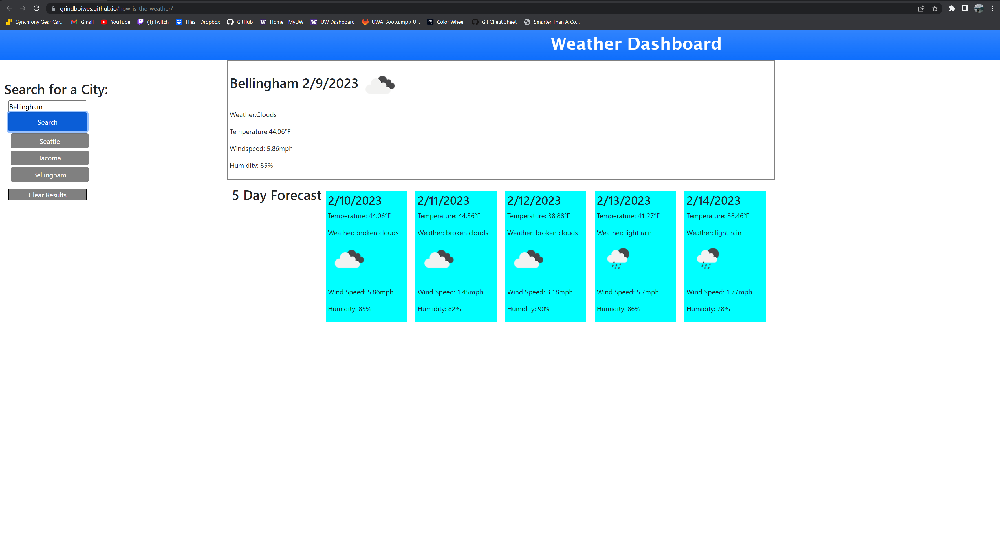

# how-is-the-weather
Weather App that displays the current day, as well as a 5 day forecast.

# Description 
This Weather Dashboard was created to keep you updated on the current weather, as well as show you the next 5 days. When searching a city, you will first be met with the Current Weather at the top of the page. This will display the city name, the date, followed by an icon representing the weather. Underneath you will find the weather that relects the icon, The temperature for the day, the windspeed, as well as the humidity. Following this, you will also be give the next 5 day forecast for that selected city with all of the information that is displayed inside the current weather. 

Once that search is complete, simply type in a new city that will refresh the page with that newly searched cities weather information. Under the search bar, there will be buttons that appear so you can revisit a city that you have previously searched for. If the list gets to long, simply click the clear results button at the bottom to delete that list from the searched cities section. 

# Screenshot  

# Links 

Github : https://github.com/GrindBoiWes/how-is-the-weather

Website : https://grindboiwes.github.io/how-is-the-weather/

# Credit 
Credit to askBCS for helping troubleshoot errors I encountered, as well as various youtube videos on using server side apis. The study group I am involved with has been a great help in sharing code, and helping overcome any obstacle we encounter that we can't find an issue with.